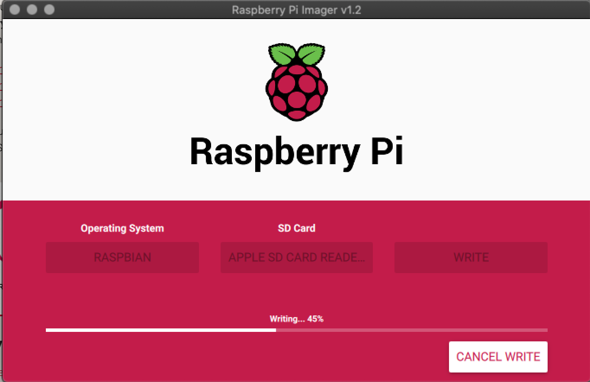

# Python based raspbarry Pi sensor and azure client

Setup a raspberry as a sensor monitor for Blue Robot

# Install raspbian

> Download, install Imager from the official raspberry pi page.
<https://www.raspberrypi.org/downloads/>

Start the imager software and flash the raspberry SD card.

Install Python3

Copy .py file to, this file is referenced in .service

> /home/pi/BluePiSensor/sensehat_program.py

# Server:

telegraf consumer:
https://github.com/influxdata/telegraf/blob/release-1.14/plugins/inputs/eventhub_consumer/README.md

# Linux service

configure systemd service

> sudo nano /lib/systemd/system/bluesensor.service

Paste .service content

Save file

Reload systemd daemon

> sudo systemctl daemon-reload

Start service

> sudo systemctl start bluesensor.service

Check service status 

> sudo systemctl status bluesensor.service

run at startup:
https://www.raspberrypi-spy.co.uk/2015/10/how-to-autorun-a-python-script-on-boot-using-systemd/
